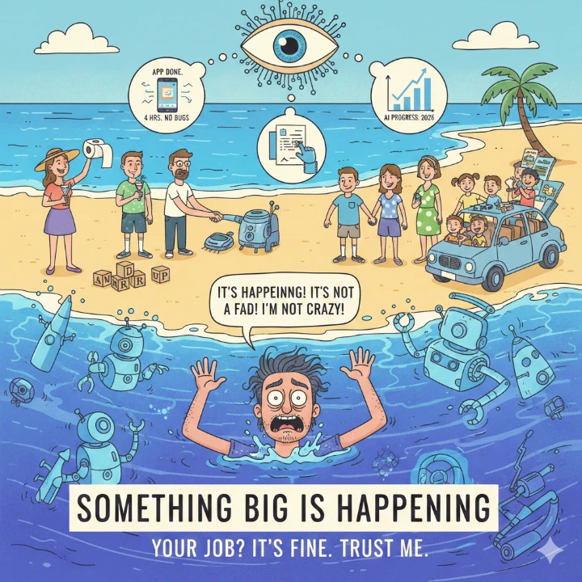

> *"The number goes up. This is entire product."*

---

Bayangkan Februari 2020. Sebagian kecil dari kita mungkin memperhatikan berita tentang virus yang menyebar di luar negeri. Tapi sebagian besar tidak. Pasar saham bagus, anak-anak sekolah, kita makan di restoran, berjabat tangan, merencanakan liburan. Jika seseorang bilang dia menimbun tisu, kamu akan mengira dia terlalu sering berada di sudut internet yang aneh. Kemudian, dalam sekitar tiga minggu, seluruh dunia berubah. Kantormu tutup, anak-anakmu pulang, dan hidup berubah menjadi sesuatu yang tidak akan kamu percaya jika kamu menggambarkannya sebulan sebelumnya.

Matt Shumer, co-founder HyperWrite dan investor AI, menulis bahwa kita sedang berada di fase "sepertinya berlebihan" dari sesuatu yang jauh lebih besar daripada Covid. Dia menulis ini untuk keluarga, teman, dan orang-orang yang dia pedulikan yang terus bertanya "jadi apa sih deal dengan AI?" dan mendapat jawaban yang tidak adil terhadap apa yang sebenarnya terjadi. Selama ini dia memberikan versi sopan, versi koktail.

Karena versi jujurnya terdengar seperti dia sudah gila. Dan untuk sementara waktu, dia berkata pada dirinya bahwa itu alasan yang cukup baik untuk menyimpan apa yang sebenarnya terjadi. Tapi kesenjangan antara yang dia katakan dan apa yang sebenarnya terjadi sudah terlalu besar. Orang-orang yang dia pedulikan pantas mendengar apa yang akan datang, bahkan jika itu terdengar gila.

Pada 5 Februari 2026, dua lab AI utama merilis model baru di hari yang sama: GPT-5.3 Codex dari OpenAI, dan Opus 4.6 dari Anthropic (pembuat Claude, salah satu main competitors ke ChatGPT). Dan sesuatu terklik. Bukan seperti saklar, tapi lebih seperti momen kamu menyadari bahwa air sudah naik sampai ke dada. Matt tidak lagi dibutuhkan untuk pekerjaan teknis sebenarnya dari pekerjaannya.

Dia menggambarkan hasil pekerjaannya dengan bahasa Inggris sederhana: "I am no longer needed for the actual technical work of my job. I describe what I want built, in plain English, and it just... appears. Not a rough draft I need to fix. The finished thing. I tell the AI what I want, walk away from my computer for four hours, and come back to find work done. Done well, done better than I would have done it myself, with no corrections needed."

Intinya: AI telah menjadi sangat cerdas sehingga Matt sebagai CEO perusahaan AI bisa mengatakan bahwa dia tidak lagi dibutuhkan untuk pekerjaan teknis sebenarnya dari pekerjaannya. AI sekarang bisa menulis puluhan ribu baris kode, membuka aplikasi itu sendiri, mengujinya, sampai menentukan bahwa aplikasi itu siap untuk kamu tes. Dan ketika kamu mengujinya, hasilnya biasanya sempurna.

Dan sekaranglah waktunya. Bukan hanya mendengarkan, tapi juga benar-benar terjadi. Kita memasuki fase di mana lompatan besar (seperti Covid 2020) diubah menjadi sesuatu yang jauh lebih besar dalam hitungan bulan, bukan tahun-tahun. Kita memasuki "Intelligence Explosion" — AI menjadi sangat cerdas sehingga bisa membantu pembuatan dirinya sendiri. Ini bukan sekadar model language yang lebih baik, ini adalah aparatus yang sedang dibangun yang mampu berpikir independen, melakukan analisis, mengambil keputusan, dan mengeksekusi tugas-tugas rumit.

Dampaknya jelas: **50% pekerjaan entry-level white-collar akan hilang dalam 1-5 tahun**. Pernyataan Dario Amodei (CEO Anthropic) tentang ini. Dan banyak orang di industri AI mengatakan dia terlalu konservatif. Tapi dengan data yang Matt bagikan (February 5th, new models released), perubahannya sedang terjadi SANGAT cepat.

Poin penting yang disampaikan Matt:
1. **Start using AI seriously** - Jangan hanya pakai sebagai search engine. Gunakan untuk pekerjaan nyata.
2. **Paid version matters** - Free versi sudah setahun di belakang. Untuk bisa mengikuti perkembangan, butuh langganan.
3. **Don't assume limitations** - Kalau AI pertama kali tidak sempurna, enam bulan lagi akan jauh lebih baik.
4. **Time to adapt** - Ini mungkin tahun paling penting dalam karir kamu. Window kesempatan untuk belajar dan mengadaptasi masih terbuka lebar.

Sebagai penutup, Matt memberi gambaran tentang apa yang harus dilakukan:
> *"Start using AI seriously, not just as a search engine. Sign up for the paid version of Claude or ChatGPT. It's $20 a month. But two things matter right away. First: make sure you're using the best model available, not just the default. These apps often default to a faster, dumber model. Dig into settings or model picker and select the most capable option. Right now that's GPT-5.2 on ChatGPT or Claude Opus 4.6 on Claude, but it changes every couple of months. If you want to stay current on which model is best at any given time, you can follow me on X (@mattshumer_). I test every major release and share what's actually worth using."*

---

**Ini adalah peringatan, bukan hanya berita menakutkan.** Ini adalah panggilan untuk bersiap menghadapi perubahan besar yang akan datang.

**Source:** [Matt Shumer di X](https://x.com/mattshumer_) - CEO HyperWrite, menulis essay tentang AI revolution 2026
